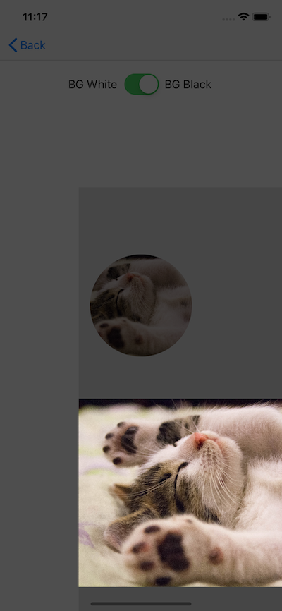
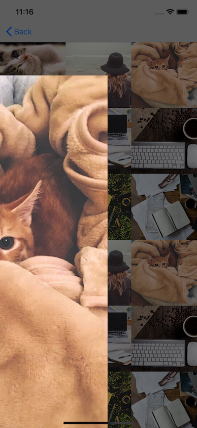

# TransitionController

[](https://cocoapods.org/pods/TransitionController)
[](https://cocoapods.org/pods/TransitionController)
[](https://cocoapods.org/pods/TransitionController)
[](https://developer.apple.com/swift/)

## Introduce

You can dismiss transition and present transition between UIViewController, UINavigationController, UITabBarController, UICollectionViewController, and UITableViewController.<br>
Receives a delegate for the willPresent, didPresent, willDismiss and didDismiss of the ViewController.

|||
|---|---|
|||


## Requirements

`TransitionController` written in Swift 5.0. Compatible with iOS 8.0+

## Installation

TransitionController is available through [CocoaPods](https://cocoapods.org). To install
it, simply add the following line to your Podfile:

```ruby
pod 'TransitionController'
```

## Usage

```swift
import TransitionController
```

```swift
class ImageViewController {
  @IBOutlet private weak var imageView: UIImageView!

  @IBAction private func transitionTap(_ sender: UIButton) {
    guard let viewController = UIStoryboard(name: "Image", bundle: nil).instantiateViewController(withIdentifier: "ImageTransitionController") as? ImageTransitionController else { return }
    // let viewController = ImageTransitionController()

    viewController.transitionDelegate = self
    viewController.imageView.image = self.imageView.image
    self.present(viewController, animated: true, completion: nil)
  }
}
```

```swift
// MARK: TransitionDelegate
extension ImageViewController: TransitionDelegate {
    var transitionSuperview: UIView {
        return self.view
    }

    func transitionPresentFromView(_ base: BaseTransition) -> UIView? {
        return self.imageView
    }

    func transitionPresentFromImage(_ base: BaseTransition) -> UIImage? {
        return self.imageView.image
    }

    func transitionDismissToView(_ base: BaseTransition) -> UIView? {
        return self.imageView
    }
}
```

#### TransitionController

```swift
import UIKit
import TransitionController

class ImageTransitionController: TransitionViewController {
    @IBOutlet weak var imageView: UIImageView!

    override var presentToView: UIView? {
        let view = UIView(frame: self.imageView.frameForImageInImageViewAspectFit)
        view.contentMode = .scaleAspectFit
        return view
    }

    override var dismissFromView: UIView? {
        return self.imageView
    }

    override var dismissFromImage: UIImage? {
        return self.imageView.image
    }
}
```

```swift
extension UIImageView {
    var frameForImageInImageViewAspectFit: CGRect {
        if  let img = self.image {
            let imageRatio = img.size.width / img.size.height
            let viewRatio = self.frame.size.width / self.frame.size.height
            if(imageRatio < viewRatio) {
                let scale = self.frame.size.height / img.size.height
                let width = scale * img.size.width
                let topLeftX = (self.frame.size.width - width) * 0.5
                return CGRect(x: topLeftX, y: 0, width: width, height: self.frame.size.height)
            } else {
                let scale = self.frame.size.width / img.size.width
                let height = scale * img.size.height
                let topLeftY = (self.frame.size.height - height) * 0.5
                return CGRect(x: 0, y: topLeftY, width: self.frame.size.width, height: height)
            }
        }
        return CGRect(x: 0, y: 0, width: 0, height: 0)
    }
}
```

Done! 🎉🎉🎉

<br><br>

### Superclass

```swift
class ExampleViewController: TransitionViewController {

}

class ExampleNavigationController: TransitionNavigationController {

}

class ExampleTabBarController: TransitionTabBarController {

}

class ExampleTableViewController: TransitionTableViewController {

}

class ExampleCollectionViewController: TransitionCollectionViewController {

}
```

### BaseTransition Controller protocol

```swift
// indexPath or sequence or etc
var key: Any? { set get }

// transitionContext.containerView
// Top-level view of a transition
var containerView: UIView? { get }


// duration when present
var presentDuration: TimeInterval { get }

// destination view when present
var presentToView: UIView? { get }


// duration when dismiss
var dismissDuration: TimeInterval { get }

// Start point view when dismiss
var dismissFromView: UIView? { get }

// Start point image when dismiss
var dismissFromImage: UIImage? { get }

// gesture enabled 
// UINavigationController Back Swipe: UIScreenEdgePanGestureRecognizer
// Transition Gesture: UIPanGestureRecognizer
func transitionRecognizerShouldBegin(_ gestureRecognizer: UIGestureRecognizer) -> Bool
```

### Delegate
```swift
// MARK: TransitionDelegate
extension ViewController: TransitionDelegate {
    var transitionSuperview: UIView {
        return self.view
    }

    func transitionPresentFromView(_ base: BaseTransition) -> UIView? {
        return self.imageView
    }

    func transitionPresentFromImage(_ base: BaseTransition) -> UIImage? {
        return self.imageView.image
    }

    func transitionDismissToView(_ base: BaseTransition) -> UIView? {
        return self.imageView
    }

    func transitionWillPresent(_ base: BaseTransition, viewController: UIViewController) {
        print("transitionWillPresent")
    }

    func transitionDidPresent(_ base: BaseTransition, viewController: UIViewController) {
        print("transitionDidPresent")
    }

    func transitionWillDismiss(_ base: BaseTransition, viewController: UIViewController) {
        print("transitionWillDismiss")
    }

    func transitionDidDismiss(_ base: BaseTransition, viewController: UIViewController) {
        print("transitionDidDismiss")
    }

    func transitionGesture(_ base: BaseTransition, viewController: UIViewController, gesture: UIPanGestureRecognizer, progress: CGFloat) {
        switch gesture.state {
        case .began:
            base.transitionView.backgroundColor = .black
        case .changed:
            base.transitionView.backgroundColor = UIColor.black.withAlphaComponent(progress / 3)
        default:
            break
        }
    }
}
```

## <a href="https://github.com/pikachu987/TransitionController/archive/master.zip">More Example</a>


## Author

pikachu987, pikachu77769@gmail.com

## License

Copyright (c) 2019 pikachu987 <pikachu77769@gmail.com>

Permission is hereby granted, free of charge, to any person obtaining a copy
of this software and associated documentation files (the "Software"), to deal
in the Software without restriction, including without limitation the rights
to use, copy, modify, merge, publish, distribute, sublicense, and/or sell
copies of the Software, and to permit persons to whom the Software is
furnished to do so, subject to the following conditions:

The above copyright notice and this permission notice shall be included in
all copies or substantial portions of the Software.

THE SOFTWARE IS PROVIDED "AS IS", WITHOUT WARRANTY OF ANY KIND, EXPRESS OR
IMPLIED, INCLUDING BUT NOT LIMITED TO THE WARRANTIES OF MERCHANTABILITY,
FITNESS FOR A PARTICULAR PURPOSE AND NONINFRINGEMENT. IN NO EVENT SHALL THE
AUTHORS OR COPYRIGHT HOLDERS BE LIABLE FOR ANY CLAIM, DAMAGES OR OTHER
LIABILITY, WHETHER IN AN ACTION OF CONTRACT, TORT OR OTHERWISE, ARISING FROM,
OUT OF OR IN CONNECTION WITH THE SOFTWARE OR THE USE OR OTHER DEALINGS IN
THE SOFTWARE.
